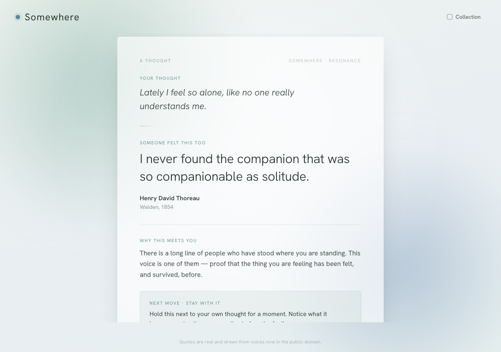
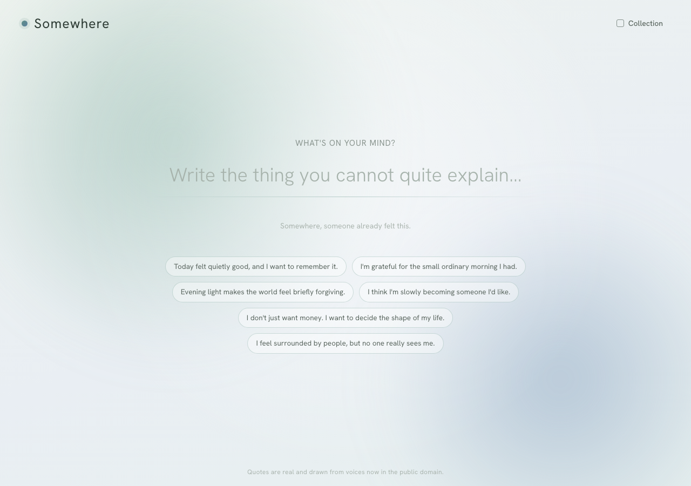
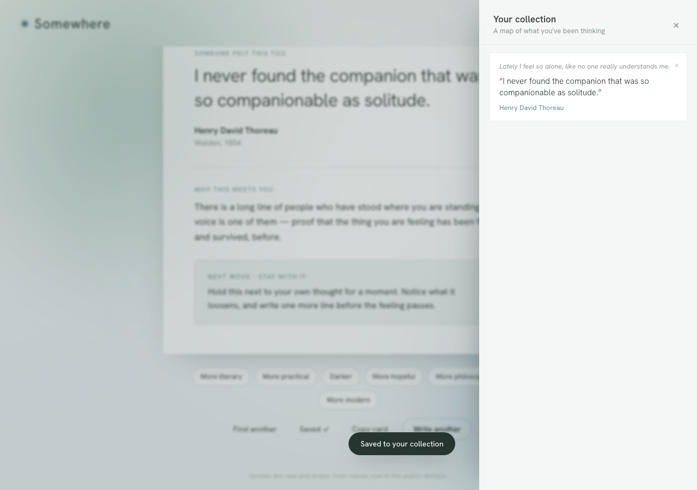
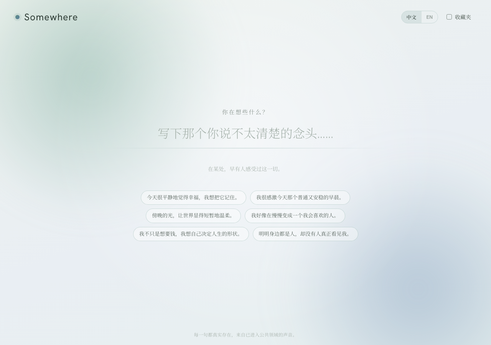
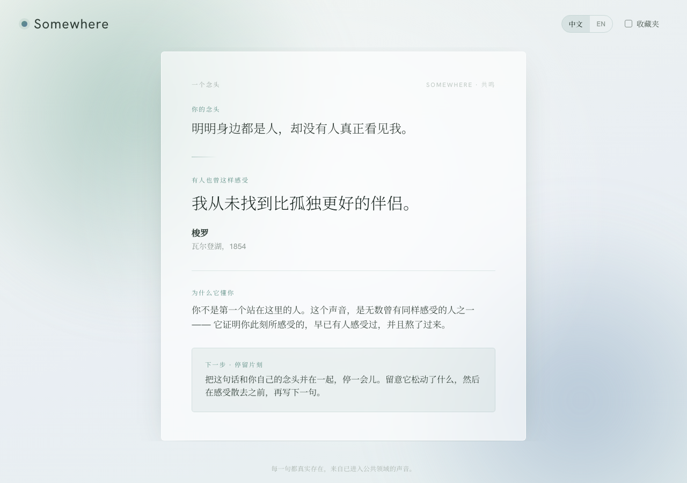

<h1 align="center">Somewhere</h1>
<p align="center"><em>A thought, met across time.</em></p>

<p align="center">
  <a href="https://ningchenma.github.io/somewhere/"><b>▶ Try the live demo</b></a>
</p>

<p align="center">
  
</p>

---

## What it is

Write down the thing you're feeling — the one you can't quite explain — and **Somewhere** answers with the voice of someone who already felt it. Not a chatbot's opinion, but a real line from a writer now in the public domain: Marcus Aurelius, Rilke, Dickinson, Thoreau, Lao Tzu, Seneca, Woolf. It shows you the quote, *why it meets you*, and one gentle next move. You can keep the ones that land in a small personal **Collection** — a quiet map of what you've been thinking.

It's a one-breath ritual: **one thought in, one resonance out.**

> **Bilingual / 双语** — toggle **中文 / EN** in the top-right. The Chinese version isn't a translation: it draws on its own canon — 老子、庄子、论语、唐诗宋词（李白、杜甫、王维、苏轼、李清照…）、鲁迅、泰戈尔（郑振铎 译）— alongside Western voices rendered in Chinese. It opens in Chinese for visitors whose browser is set to Chinese.

## Why I built it

The feelings that are hardest to sit with are the ones that make you feel *alone* — "I'm surrounded by people but no one really sees me," "I don't just want money, I want to decide the shape of my life," "I think I'm slowly becoming someone I'd like." In those moments you don't need information. You need to know the feeling isn't new, isn't broken, isn't only yours.

It almost never is. Someone, somewhere, already felt exactly this — and put it into words so good they survived for centuries. Somewhere exists to hand you that line at the moment you need it, so a private feeling becomes a thread connecting you to everyone who came before.

## The problem it solves

A feeling you can't name is heavy and isolating. The usual options don't help much:

- **Search** gives you SEO listicles of decontextualized "top 50 quotes."
- **Journaling** lets you express the feeling, but nothing answers back.
- **A friend** is the real fix — but not always awake, not always the right words.

Somewhere is the missing middle: you say the true thing, and the best of human writing answers — matched to your *meaning*, not your keywords, with a reason it fits and an attribution you can trust.

## Why not just use AI directly?

Fair question — so here's the honest answer. Somewhere *can* use an LLM as its engine. The point isn't "AI bad." The point is that **a raw chat box is the wrong interface and the wrong posture for this need**, in four specific ways:

1. **Trust in the source.** Ask a general chatbot for a quote and it will hand you a beautiful line confidently attributed to the wrong person — or to no one, because it made it up. Somewhere is built *around* provenance: real, verifiable voices, drawn from the public domain, with every card labeled `exact`, `paraphrased`, or `inspired`. You can believe what you're reading.

2. **A ritual, not a conversation.** An empty prompt that can do anything asks *you* to do the work — to frame, to steer, to prompt-engineer. Somewhere asks for one thing (a thought) and gives one thing (a resonance). The constraint is the product: it's calm, contained, and over in a breath. No chat to manage.

3. **Company, not advice.** AI's reflex is to fix you — bullet points, action items, reframes. Somewhere deliberately doesn't. It sits *with* the feeling and offers a hand across time. The most healing thing isn't a solution; it's "someone has been exactly here, and survived it."

4. **Taste, and something to keep.** Somewhere is a curated lens — a specific canon of writers chosen for how they meet the human interior — not a firehose. And what you keep becomes yours: your Collection is a journal written in other people's words, building a portrait of your inner life over time. Chat history is something you scroll past and forget.

In short: the AI, when used, is an *ingredient* — disciplined by real attribution and wrapped in intentional design. It is never the interface.

## How it works

<table>
<tr>
<td width="50%"></td>
<td width="50%"></td>
</tr>
<tr>
<td align="center"><sub><b>Write the thing you can't quite explain</b></sub></td>
<td align="center"><sub><b>Keep what meets you, in your Collection</b></sub></td>
</tr>
<tr>
<td width="50%"></td>
<td width="50%"></td>
</tr>
<tr>
<td align="center"><sub><b>中文：写下那个你说不太清楚的念头</b></sub></td>
<td align="center"><sub><b>遇见一句懂你的话</b></sub></td>
</tr>
</table>

1. **Write** a thought — or tap one of the example prompts.
2. Somewhere **names the feeling underneath** and searches for the one quote that meets it — on meaning, not shared words.
3. You get a **resonance card**: your thought, the quote and its author, *why this meets you*, and a small next move.
4. **Reshape it** — try a different tone (more literary, more hopeful, darker), or find another voice.
5. **Save** the cards that land. They live in your Collection, on your device.

## The resonance engine

The matching has two layers:

- **With an AI runtime** (e.g. embedded in a host that provides one), Somewhere asks a model to name the core tension in your words and surface the single most fitting *real* quotation — under strict rules: a real, identifiable author; public-domain voices preferred; no fabrication; provenance labeled honestly.
- **As a standalone static page** (this demo), there's no model call, so Somewhere falls back to a **local theme-matcher** over a hand-curated set of ~40 verified public-domain quotes. The quote is always real and correctly attributed; the prose ("why this meets you") uses a built-in reflection rather than a bespoke one.

> To run the full AI experience on a public site, the model call needs a tiny backend (a serverless function holding the API key — a key can't live in a public page). The prompt and parsing are already in the code, so wiring that up is straightforward.

## Run it

It's a single, dependency-free HTML file — no build step.

```bash
# clone, then just open it
open index.html
# …or serve it
python3 -m http.server 8000   # then visit http://localhost:8000
```

## Tech

Plain HTML, CSS, and vanilla JavaScript in one file. [Hanken Grotesk](https://fonts.google.com/specimen/Hanken+Grotesk) for type. Your Collection persists in `localStorage`. No tracking, no accounts, no backend.

## A note on the quotes

Every quote is real and drawn from voices now in the **public domain**. If you ever spot a misattribution, please open an issue — accuracy is the whole point.

---

<p align="center"><sub>Built by <a href="https://ningchenma.github.io/">Ningchen Ma</a> · Somewhere · a thought, met across time</sub></p>
